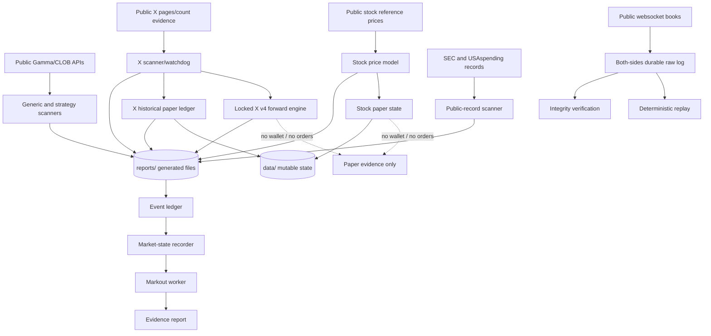

# Codex Handoff

Prepared at **2026-07-20T23:20:36Z** from the active source root:

```text
/data/workspace/polymarket-research
```

This is migration documentation only. No trading logic, strategy threshold, scheduler entry, runtime state, or remote repository was changed.

## 1. Safety and current operating mode

The project is **paper-only**.

- No live orders are allowed.
- No wallet or Polymarket authentication is used by the scheduled bots.
- No private keys are needed.
- No code in this handoff authorizes a live transition.
- The scheduled jobs remained enabled and unchanged during repository preparation.
- A statistical pass would still not authorize live trading; it would require a separate explicit safety review and authorization.

Read `AGENTS.md` before changing anything.

## 2. What the project currently does

The active project is a collection of related paper-research pipelines:

1. **Generic public Polymarket scanner** scans active markets and public CLOB books for stale markets, crossed books, and multi-outcome pricing anomalies. `edge_watchdog.py` only emits new paper alerts meeting its executable-score filter.
2. **Stock/price paper bot** discovers stock threshold markets, obtains public reference prices, calculates model fair values, records public books, applies a consensus entry filter, and maintains simulated positions.
3. **X post-count research** parses public post-count/event information, models outcome buckets, validates public order-book depth, records snapshots, and maintains historical paper ledgers.
4. **Locked X v4 forward validation** prospectively captures separately timed decision/fill books, fees, fills, partial exits, residual positions, and settlement proof for a frozen baseline plus three registered candidate arms.
5. **Public-record reaction scanner** collects SEC and USAspending events and matches them to public tickers and Polymarket markets.
6. **Shared event-evidence pipeline** normalizes immutable events, records market state, calculates later markouts, and produces evidence reports without backfilling invalid timestamps.
7. **Both-sides collector** collects public websocket order-book frames into hash-chained, compressed archives and supports integrity audit and deterministic replay.

## 3. Confirmed source root

`/data/workspace/polymarket-research` is the real operational source root because:

- every active Python entrypoint resolves into it;
- active wrappers use it explicitly or `cd` into it;
- mutable state is stored in its `data/` directory;
- generated reports and raw evidence are stored in its `reports/` directory;
- locked X configuration and source hashes refer to paths under it;
- the shared evidence scheduler uses it as its working directory.

`/data/workspace/polymarket-research/repos/polymarket12` is a separate nested prototype with its own `.git` directory and virtual environment. It is not the active parent project and is excluded from the new repository. Its nested working tree was already dirty before this migration preparation (`src/polybot/paper_trader.py` and `tests/test_paper_trader.py` modified); do not absorb, clean, or rewrite it as part of the parent handoff.

## 4. Runtime and dependencies

### Active runtime

- Host interpreter: `/usr/local/bin/python3`
- Verified version: Python `3.13.14`
- Node application: none at the active root
- `package.json`/`package-lock.json`: none required

The host's bare `python` command may resolve to an environment missing `openpyxl`, `zstandard`, or `hypothesis`. Reproduce the scheduler with `/usr/local/bin/python3` or a virtual environment built from the committed dependency files.

### Dependency records

- `requirements.txt`: runtime dependencies
- `requirements-dev.txt`: runtime plus deterministic-test dependencies
- `pyproject.toml`: Python requirement, metadata, and tool configuration
- `.python-version`: verified runtime version

Pinned packages:

- `requests==2.34.2`
- `websockets==15.0.1`
- `openpyxl==3.1.5`
- `zstandard==0.23.0`
- `hypothesis==6.156.7` for tests

## 5. Architecture and data flow



### Evidence boundary

A theoretical model edge or later settlement is not automatically an executable paper trade. Execution eligibility requires correctly identified instruments, causal request/response timestamps, post-decision books, displayed depth, fees, and settlement evidence. The project preserves missing evidence and no-trades rather than silently dropping them.

## 6. Main entrypoints

| Purpose | Entrypoint | Notes |
|---|---|---|
| Generic edge schedule | `edge_watchdog.py` | Calls `strategy_scanner.py`; public data only |
| Generic direct scan | `strategy_scanner.py` | Writes generated report files |
| Stock schedule | `stock_price_paper_bot.py` | Mutates stock paper state and reports when run normally |
| Stock/model scanner | `multi_market_research_bot.py` | Public stock/news/wallet research; public wallet addresses only |
| X scheduled scan | `xtracker_tweet_watchdog.py` | Produces X snapshots and decisions |
| X current forward engine | `xtracker_forward_engine_v4.py` | Validates source/manifest locks, then entry and monitor passes |
| X forward capture core | `xtracker_forward_capture.py` | Paper latency, identity, fee, and fill evidence |
| X forward monitor | `xtracker_forward_monitor_v4.py` | Paper exit, rebalance, residual, settlement handling |
| X historical paper ledger | `xtracker_paper_rebalance_ledger.py` | Historical paper calculations; not the v4 promotion sample |
| X historical watchdog | `xtracker_rebalance_paper_watchdog.py` | Refreshes historical paper report |
| Public records | `public_record_reaction_watchdog.py` | Calls `public_record_reaction_bot.py` |
| Shared event ingestion | `event_ledger.py` | Append-only normalized evidence |
| Market observations | `market_state_recorder.py` | Public market state capture |
| Markouts | `markout_worker.py` | Later-window outcomes/economics |
| Evidence summary | `evidence_report.py` | Aggregates without authorizing edge claims |
| Both-sides CLI | `python -m both_sides_spike` | `smoke`, `rolling`, and `audit` subcommands |
| Exact supervised collector runner | `both_sides_supervised_runner.py` | One exact run directory |
| X v4 verifier | `verify_xtracker_forward_v4.py` | Reads live/frozen evidence and writes generated audit output |

Exploratory/legacy scripts such as `x_tweet_count_probe.py`, `x_tweet_count_app_probe.py`, and `x_tweet_count_variants.py` are not the active X schedule. They may require optional X API environment variables and must never receive committed values.

## 7. Scheduled execution

Full schedule and wrapper commands are in `deploy/runtime-manifest.md`.

Operational jobs observed as enabled:

- Generic edge watchdog: every 15 minutes
- X watchdog + v4 forward engine: every 5 minutes
- Stock paper bot: every 60 minutes
- X historical rebalance watchdog: every 60 minutes
- Public-record scanner: hourly during 11:00–22:00 UTC on weekdays
- Shared event-evidence pipeline: every 5 minutes

Live wrappers remain in `/data/scripts`. Repository copies under `deploy/scripts/` are inactive templates only. Do not manually execute a wrapper while its scheduled job is enabled.

## 8. Configuration

Committed configuration templates/locks:

```text
/data/workspace/polymarket-research/config/xtracker_forward_validation_v1.json
/data/workspace/polymarket-research/config/xtracker_forward_validation_v2.json
/data/workspace/polymarket-research/config/xtracker_forward_validation_v3.json
/data/workspace/polymarket-research/config/xtracker_forward_validation_v3.lock.json
/data/workspace/polymarket-research/config/xtracker_forward_validation_v4.json
/data/workspace/polymarket-research/config/xtracker_forward_validation_v4.lock.json
```

Important strategy constants also exist directly in source modules. This migration did not extract or change them.

`.env.example` lists only optional X research variable names with blank values. The scheduled paper system does not need a Polymarket wallet or live-order credential.

## 9. Runtime data, databases, logs, and reports

These paths are intentionally outside Git and must be backed up separately.

### Mutable runtime state

```text
/data/workspace/polymarket-research/data/
```

Known contents include:

- `paper_trades.sqlite` — runtime SQLite database
- `stock_price_paper_state.json`
- `xtracker_tweet_watchdog_state.json`
- `xtracker_rebalance_paper_watchdog_state.json`
- `public_record_reaction_state.json`
- `edge_watchdog_seen.json`
- `public_wallets.txt` — public-address input, still treated as runtime data

### Generated reports and evidence

```text
/data/workspace/polymarket-research/reports/
```

This tree is approximately 4.4 GiB and includes:

- paper summaries and ledgers in JSON/Markdown/CSV/XLSX;
- append-only JSONL decision and event chains;
- captured order books and raw identity/fee evidence;
- X v4 state, status, registries, and raw references;
- immutable strategy freeze evidence;
- both-sides compressed raw archives, manifests, logs, and audits;
- the event-evidence pipeline lock file.

Important exact subpaths:

```text
reports/xtracker_forward_validation/v4/
reports/xtracker_strategy_freeze/xtracker_frozen_20260720T151927Z/
reports/both_sides_spike/
reports/stock_price_paper_summary_latest.json
reports/xtracker_rebalance_paper_summary_latest.json
reports/public_record_reaction_summary_latest.json
reports/event_evidence_report_latest.json
```

Observed explicit process log:

```text
reports/both_sides_spike/supervised/runs/supervised_20260720T143929Z_691704ba/collector_process.log
```

### Nested prototype and environments

```text
/data/workspace/polymarket-research/repos/
```

The nested `polymarket12` prototype and its approximately 222 MiB `.venv` remain outside the parent Git repository.

## 10. Source/config/runtime classification

### A. Source that belongs in Git

- Root operational `*.py` modules
- `both_sides_spike/*.py`
- Root `test_*.py` files
- `deploy/scripts/*.sh` inactive wrapper templates
- `tools/secret_scan.py`
- Documentation and dependency metadata

### B. Configuration templates that belong in Git

- `config/*.json`, including protocol locks
- `.env.example` with blank placeholders only
- `pyproject.toml`
- `requirements*.txt`
- `.python-version`

### C. Runtime data outside Git

- entire `data/` tree
- entire `reports/` tree
- scheduler output under Hermes runtime directories
- lock files generated inside `reports/`

### D. Secrets outside Git

- `.env` and environment-specific variants
- X API keys/tokens and access-token secrets
- cookies/session material
- PEM/key/SSH files
- wallet files, private keys, keystores, seed phrases, mnemonics
- any future service credentials

### E. Large/generated files outside Git

- compressed raw `.bssraw` archives
- captured books and raw JSON/JSONL
- report CSV/XLSX/JSON/Markdown generated by runs
- SQLite files and WAL/SHM files
- logs
- Parquet/Arrow/Feather/ORC/Avro files
- caches, bytecode, virtual environments
- the nested repository

Deterministic fixtures under `tests/fixtures/`, `testdata/`, or `fixtures/` are explicitly re-included by `.gitignore` even when they use data-like extensions.

## 11. Local setup

Use an isolated checkout and virtual environment:

```bash
cd /data/workspace/polymarket-research
/usr/local/bin/python3 -m venv .venv
. .venv/bin/activate
python -m pip install --upgrade pip
python -m pip install -r requirements-dev.txt
```

Do not run a normal bot entrypoint against the live root while its scheduler is enabled. For local validation, use self-tests and unit tests, which use assertions and temporary directories.

## 12. Tests

### Core deterministic suite

```bash
python -m unittest -v \
  test_both_sides_spike.py \
  test_event_evidence_pipeline.py \
  test_strategy_evidence_integration.py \
  test_xtracker_forward_capture.py \
  test_xtracker_forward_v4.py
```

### Narrow self-tests

```bash
python stock_price_paper_bot.py --self-test
python multi_market_research_bot.py --self-test
python public_record_reaction_bot.py --self-test
```

### Host integration test

```bash
python -m unittest -v test_both_sides_collector_supervisor.py
```

This imports `/data/scripts/both_sides_collector_supervisor.py`. The attempted migration copy of that helper and `/data/scripts/both_sides_collector_postrun_audit.py` was blocked by the environment, so both remain external host dependencies.

### Syntax verification

```bash
python -m compileall -q \
  both_sides_spike \
  *.py \
  deploy/scripts \
  tools
```

## 13. Deterministic replay

### Self-contained replay fixture

```bash
python -m unittest -v test_both_sides_spike.RawLogReplayTests
```

This creates temporary hash-chained raw logs and requires repeated replay hashes to match.

### Copied collector run

```bash
python -m both_sides_spike audit /path/to/copied/run/manifest.json
```

The manifest's raw-log path must resolve. Use a copied/static run, not an archive that is still growing. Verify integrity before interpreting any economic output.

### X v4 evidence verification

`verify_xtracker_forward_v4.py` verifies the lock, frozen manifest, append-only chains, raw hashes, activation cutoff, causal timing, and state/ledger reconciliation. It writes generated audit files under the v4 report directory. Do not run it concurrently with a scheduled append against the live evidence tree; run against a controlled snapshot or at an explicitly coordinated maintenance point.

## 14. Current strategy assumptions

### Generic edge scanner

- Uses public Gamma/CLOB data only.
- Alerts only selected anomaly classes with an executable score of at least 2.
- Stale/expired listings are research flags, not executable trades.

### Stock/price paper bot

Current filter version: `stock_price_consensus_v2_2026_07_16`.

Key assumptions include:

- model edge at least `0.08`;
- fair probability at least `0.25`;
- maximum ask `0.85`;
- minimum visible size `5`;
- at least 9 consensus checks;
- maximum entry spread `0.06`;
- edge/spread ratio at least `1.25`;
- public reference-price distance at least `0.005`;
- fixed paper quantity of 100 shares.

### X operational filter

Current watchdog filter: `consensus_v3_2026_07_16`.

Key assumptions include:

- minimum model edge `0.35`;
- minimum fair value `0.60`;
- maximum ask `0.35`;
- maximum 100 hours remaining;
- tighter handling of low buckets early in a window;
- visible depth, spread, and bid-support gates;
- strongest-bucket and event-lock processing.

### X v4 forward protocol

Baseline and candidate rules are fully documented in `config/xtracker_forward_validation_v4.json`. The frozen baseline exits use:

- absolute profit per share `0.03`;
- relative profit `0.20`;
- fair-collapse threshold `0.20`;
- stale-bid edge `0.10`;
- better-bucket edge delta `0.10`;
- rebalance minimum edge `0.50`;
- rebalance minimum fair `0.70`;
- rebalance maximum ask `0.25`.

Registered candidates change only one dimension each: entry limit `0.25`, event-risk cap `$10`, or 25% drawdown exit. Promotion requires at least 30 executable and net-capturable independent clusters per arm plus all preregistered statistical, stress, evidence-failure, and reconciliation gates. A substantive change requires v5 and resets the sample.

## 15. Current performance summary

These are paper/research results, not claims of live profitability.

### Stock paper bot

From `reports/stock_price_paper_summary_latest.json` at `2026-07-20T23:08:44Z`:

- 4 closed paper trades
- 3 wins / 1 loss / 0 breakeven
- 0 open positions
- fixed-100-share paper P&L: **−$17.10**
- only 1 trade marked execution-evidence eligible

### X historical rebalance report

From `reports/xtracker_rebalance_paper_summary_latest.json` at `2026-07-20T22:28:52Z`:

- 21 closed historical paper trades
- 13 wins / 7 losses / 1 breakeven
- paper P&L: **−$68.50**
- profit factor: `0.4657`
- only 1 gross-top-of-book-feasible trade

This historical ledger uses `tightened_v2_2026_07_15`, while the operational watchdog uses v3. It is not a clean validation sample of the current strategy.

### X locked forward v4

From v4 status/audit artifacts observed during handoff:

- 23 registered opportunities
- 1 eligible underlying entry lifecycle
- 1 completed executable/net-capturable cluster per arm
- required minimum: 30 per arm
- no open positions at the snapshot
- promotion gate: **false**
- interim P&L intentionally hidden
- live orders: 0
- wallet/authentication used: false

No executable positive expectancy has been established.

### Public-record pipeline

- latest scanner retained public signals, but the latest summary had 0 Polymarket-matched signals;
- X status records 0 public-record net-capturable markouts;
- no edge claim is allowed from the current sample.

### Both-sides collector

The two-hour supervised qualification run passed full replay:

- 7,932,833 durable frames
- 2,372 control records
- 0 parser errors
- 0 integrity errors
- terminal reason `collector_deadline`
- paper-only, zero live orders, no wallet/authentication

This is operational qualification, not profitability evidence.

## 16. Last known-good runs

| Component | Last known-good artifact/time | Evidence |
|---|---|---|
| Stock paper bot | `2026-07-20T23:08:44Z` | `reports/stock_price_paper_summary_latest.json` |
| X watchdog state | `2026-07-20T23:13:53.819774+00:00` | `data/xtracker_tweet_watchdog_state.json` |
| X v4 status | updated `2026-07-20T23:13:53.909Z` | `reports/xtracker_forward_validation/v4/status.json` |
| X v4 full audit | PASS at `2026-07-20T22:56:23.067482+00:00` | `reports/xtracker_forward_validation/v4/audit_latest.json` |
| X historical rebalance | `2026-07-20T22:28:52+00:00` | `reports/xtracker_rebalance_paper_summary_latest.json` |
| Public-record scanner | `2026-07-20T22:05:43.301Z` | `reports/public_record_reaction_summary_latest.json` |
| Both-sides qualification | PASS audit at `2026-07-20T16:56:48Z` | supervised run `postrun_audit.json` |

Scheduler `ok` means only that the wrapper exited successfully. It is not proof of performance, residence, or executable edge.

## 17. Known bugs and limitations

1. **Absolute paths:** many modules hard-code `/data/workspace/polymarket-research`; a clone at another path is not operationally equivalent.
2. **External wrappers:** live schedules execute `/data/scripts`, outside Git. Six shell templates are captured under `deploy/scripts`, but the scheduler was not repointed.
3. **External collector helpers:** the supervisor and post-run audit Python helpers remain only in `/data/scripts` because the copy was blocked.
4. **X lock depends on runtime evidence:** v4 requires a freeze manifest under ignored `reports/` plus the exact external wrapper hash. A source-only clone cannot run the live v4 engine.
5. **Multiple Python environments:** the bare `python` command can lack required packages; use the pinned environment.
6. **No proven edge:** X has 1/30 required clusters per arm; stock has a small negative sample; public records have zero net-capturable markouts.
7. **Historical X mismatch:** old v2 ledger rows cannot validate the operational v3/v4 definitions.
8. **Historical timing gaps:** the seven historical X losses lack strict request-start/response-received entry books and are not execution-valid entries.
9. **Public-record source issue:** the latest USAspending scan recorded an HTTP 400 for the loans endpoint.
10. **Generic stale flags:** the latest generic scan primarily surfaced expired-but-active listings, which are not automatic executable opportunities.
11. **Long-run storage:** a fresh full 24-hour both-sides run was rejected under the existing disk reserve; only a two-hour operational qualification was completed.
12. **Generated-data size:** the project directory is large because runtime evidence dominates it; Git is intentionally source-only.
13. **Research-job delivery:** the non-trading `bot-niche-x-gamechanger-watch` job last reported `unknown platform 'webui'` delivery failure.
14. **Nested dirty repository:** `repos/polymarket12` has independent uncommitted changes and must not be silently vendored.

## 18. Current rollback procedure

This migration preparation did not change operational source or schedules, so no bot rollback is required.

For future Codex changes:

1. Work on a branch; never patch the live root first.
2. Preserve a clean source commit and back up `data/`, `reports/`, and `/data/scripts` separately.
3. Before deployment, record exact source/wrapper hashes and run the deterministic test suite.
4. For X v4, run the verifier against a coordinated static snapshot. Do not modify any v4-locked source; create v5 for substantive changes.
5. Deploy only after explicit operator authorization.
6. If a deployed non-strategy change fails, stop further manual invocations, restore the last clean source commit and matching external wrapper files, verify hashes/tests, then let the existing schedule continue only after explicit operational approval.
7. Never “repair” a hash chain, rewrite runtime data, or delete an evidence failure. Restore code around immutable evidence.

Until a first baseline commit exists, the immutable X freeze and v4 lock provide integrity evidence for locked X files, but they are not a complete repository rollback for every module. The first clean commit should become the source baseline; runtime recovery still requires separate backups.

## 19. Git/secret workflow

Before the first commit:

```bash
python tools/secret_scan.py --git-candidates
git status --short
git diff --check
git add --dry-run --all
```

Stage explicit reviewed paths only. Do not stage any scanner finding until it is resolved. Do not add a remote or push.
